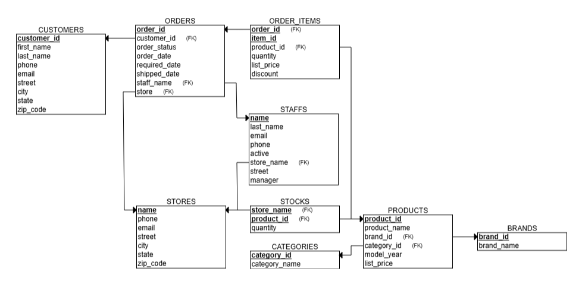
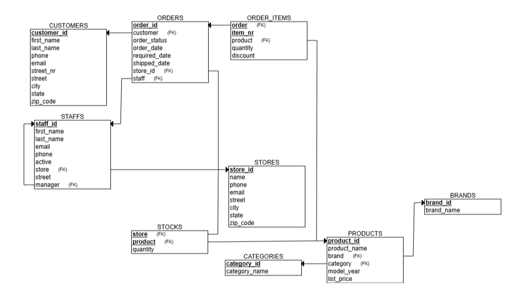
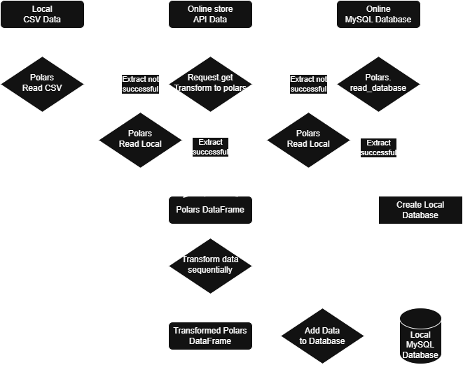

# Database overview

## Schemas

### API

|CUSTOMERS|type |notes
|---------|-| - |
|customer_ID*| INT |
|first_name|STR | 
|last_name|STR|
|phone| STR|
|email| STR| check that it conforms (-)|
|street_nr| STR | must be a string as some addresses are like '25C'|
|street| STR | fmt: nr, names; remove surrounding whitespace|
|city| STR | NOT NULL? |
|state| STR | NOT NULL|
|zip_code| INT | NOT NULL?|

| ORDER_ITEMS| type | note |
|-|-|-|
|order_id* *fk (ORDERS)*| INT |
|item_id*| INT |
|product_id *fk (PRODUCTS)*| INT |
|quantity| INT |
|list_price| FLOAT | not negative, should be removed since it is duplication |
|discount| FLOAT | 0 < discount < 1, suspicious if too large, needs not be equal for order|

| ORDERS| type | note |
|-|-|-|
|order_id*| INT|
|customer_id *fk (CUSTOMERS)*| INT |
|order_status|INT | code in [1,2,3,4]?|
|order_date|DATE|
|required_date|DATE|should not be before order_date |
|shipped_date|DATE|should not be before order_date |
|store *fk (STORES)*| STR |
|staff_name *fk (STAFFS)*| STR | ensure it matches pk in staffs|

### CSV

|STAFFS| type | note |
|-|-|-|
|name| STR | currently treated as pk |
|last_name| STR |
|email*| STR | work-email can be pk, ensure fmt|
|phone| STR | NOT NULL?, work-nr? |
|active| BOOL (TINYINT(1)) | NOT NULL |
|store_name *fk (STORES)*| STR | NOT NULL |
|street| STR | should be removed as it is data duplication with STORES|
|manager| INT | Can be null, probably refers to STAFFS, although numbers are a bit weird|

|STORES| type | note |
|-|-|-|
|name*| STR | might be a bad pk |
|phone| STR | NOT NULL
|email| STR | NOT NULL, ensure fmt, UNIQUE |
|street| STR | NOT NULL, UNIQUE, fmt: nr, name|
|city| STR | NOT NULL|
|state| STR | NOT NULL |
|zip_code| INT | NOT NULL |
### DB

|BRANDS| type | note |
|-|-|-|
| brand_id* | INT | AUTOINCREMENT
| brand_name | STR | NOT NULL, UNIQUE

|CATEGORIES| type | note |
|-|-|-|
| category_id* | INT | AUTOINCREMENT?|
| category_name | STR | NOT NULL, UNIQUE |

|PRODUCTS| type | note |
|-|-|-|
| product_id* | INT | AUTOINCREMENT |
| product_name | STR | not unique, NOT NULL |
| brand_id *fk (BRANDS)* | INT | NOT NULL |
| category_id *fk (CATEGORIES)* | INT | NOT NULL |
| model_year | INT | NOT NULL (should we include range - might have models for next year, could have old - though not likely)
| list_price | FLOAT | NOT NULL, POSITIVE |

|STOCKS| type | note |
|-|-|-|
| store_name* *fk (STORES)*| STR | NOT NULL |
| product_id* *fk (PRODUCTS)*| INT | NOT NULL |
| quantity | INT | NOT NEGATIVE, NOT NULL |

## CONNECTIONS
v = from column to row  
\> = from row to column
|      |CUST|ORD_IT|ORD|STAFF|STORE|BRAND|CAT|PROD|STOCK|
|------|:-:|:-:|:-:|:-:|:-:|:-:|:-:|:-:|:-:|
|CUST  |\ |-|v|-|-|-|-|-|-|
|ORD_IT|-|\ |>|-|-|-|-|>|-|
|ORD   |>|v|\ |>|>|-|-|-|-|
|STAFF |-|-|v|\ |>|-|-|-|-|
|STORE |-|-|v|v|\ |-|-|-|v|
|BRAND |-|-|-|-|-|\ |-|v|-|
|CAT   |-|-|-|-|-|-|\ |v|-|
|PROD  |-|v|-|-|-|>|>|\ |v|
|STOCK |-|-|-|-|>|-|-|>|\ |

### ER before

### ER Goal

Better naming of columns (no id/name appended to FKs)  
Added ID to staff, store  
Removed duplicate data list_price

### Flow of ETL process

